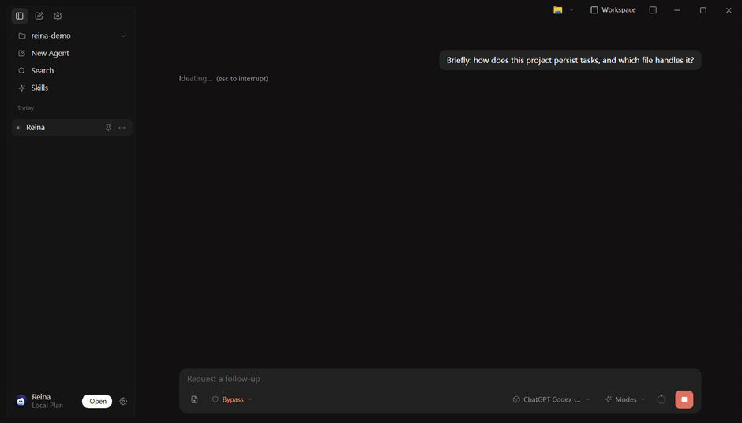

# Reina

### A local-first desktop AI agent — your data never leaves your machine

**English** · [中文](./README.zh-CN.md)

[Download](#-download--run) · [Features](#-features) · [Why local](#-why-local-first)

---

  

---

**Reina is a desktop AI agent that runs on your own machine.** It holds a continuous conversation around your local workspace — understanding your projects, organizing information, and driving tasks forward, suggesting the next step when you need it — while your files, data, and API keys stay on your computer, under your control.

Unlike cloud AI tools, Reina's core data flow **never leaves your machine**. It's built for individuals and teams with hard requirements around **privacy, compliance, and offline control** — the kind of place where "data may not be uploaded to the cloud" is a rule, not a preference.

> [!NOTE]
> Reina brings its own model layer: you configure your own models and API keys in settings (stored locally in `~/.reina/`) and decide which provider to use. No product HTTP server, no cloud backend.

## ✨ Features

- 🔒 **Local-first, your data stays put** — workspace content is never uploaded to third-party servers, satisfying "data must not leave the network" requirements.
- 🔑 **Bring your own model & keys** — API keys live in `~/.reina/`, never reach the UI layer, and stay fully under your control.
- 🧠 **Workspace context** — organizes a continuous conversation around your local projects, files, and tasks; it understands your whole workspace, not just one file.
- 💬 **Persistent sessions** — keeps the full task history so you can pause and pick up seamlessly without re-explaining context.
- 🖥️ **Multi-window desktop UX** — chat / workspace / settings in cleanly separated surfaces, hugging your local workflow instead of living in a browser tab.
- 🛡️ **Controllable & transparent** — important actions go through permission prompts; visible, pausable, resumable. Release builds hide debug entry points by default.

## 🔐 Why local-first

| | Cloud AI tools | **Reina** |
|---|---|---|
| Where your data goes | Uploaded to vendor servers | **Stays on your machine** |
| API keys | Held by the vendor | **In your own `~/.reina/`** |
| Works offline | No | **Yes (depends on your model)** |
| Compliance / intranet | Limited | **Data never leaves the network** |
| Model choice | Locked to vendor | **Freely configurable** |

If you or your team **can't hand your data to the cloud**, Reina is built for exactly that.

## 📦 Download & run

Download the build for your OS from [Releases](https://github.com/7-e1even/Reina-release/releases):

- **Windows** — installer (NSIS) and portable build.
- **macOS** — DMG or ZIP.

Install or unzip and run. First time: pick a workspace → enter your model and API key in settings → type a goal or task.

## 📄 License

Reina is licensed under [AGPL-3.0](./LICENSE).

For use in closed-source / commercial products, contact the author for a commercial license.

---

If Reina is useful to you, drop a ⭐ Star — it's the biggest encouragement for a solo developer.
 
Copyright © 2026 7-e1even

